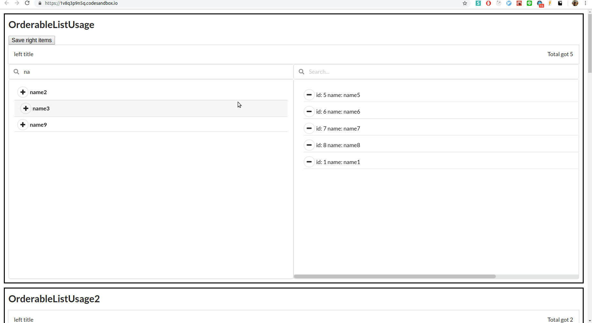

# semantic-ui-react-misc-components

some components built on top of semantic-ui-react.


## online demo

[codesandbox](https://codesandbox.io/s/1v8q3p9n5q)

## offline demo

`git clone https://github.com/JaosnHsieh/semantic-ui-react-misc-components.git`

`npm i`

`npm start`


## Usage

`npm i --save semantic-ui-react-misc-components`

add semantic-ui css file on your `index.html`

`<link rel="stylesheet" ref="//cdn.jsdelivr.net/npm/semantic-ui@2.4.0/dist/semantic.min.css">`

availabes example components

```js
import{
  OrderableListUsage,
  OrderableListUsage2,
  OrderableListUsage3,
  RenderModalUsage,
  BlurOverlayUsage,
  EditableTextUsage,
  EditableTextUsage2,
  LazyInputUsage,
  LazyInputUsage2,
  LoadingSpanUsage,
  PaginationTableUsage,
  PaginationTableUsage2,
  PaginationTableUsage3,
  PaginationTableUsage4,
  PlaceSearchUsage
} from 'semantic-ui-react-misc-components';
```

use them in JSX as

```
<EditableTextUsage />

```

check every *Usage components to see how to use them.

## Not Production Ready

I put component's usages in the component file and include other npm modules without caring about file sizes for conviences.


